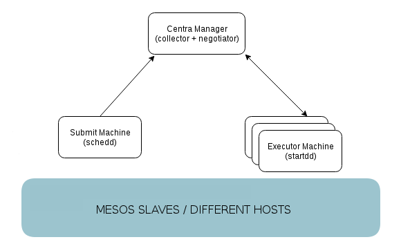

# Docker container per HTCondor 

Dockerizzazione di HTCondor dei tre nodi: Master, Submit ed Executor.
L'immagine di base utilizzata è Ubunty Trusty LTS e si fa riferimento alla versione stable di condor (https://research.cs.wisc.edu/htcondor/ubuntu/).

Per controllare e gestire i diversi processi lanciati nei singoli container, si utilizza supervisord.

E' possibile utilizzare Oneclient per esportare i dati.

## Architettura di riferimento



## Come utilizzare i Dockerfile

### Build dell'immagine 

Se si vuole compilare da codice fare il build dell'immagine docker.

```bash
$ docker build --tag dscnaf/htcondor-debian .
```

### Run dei nodi
Nodo Master:

```bash 
$ docker run -d --name=condormaster dscnaf/htcondor-debian -m
$ docker exec -it condormaster ip addr
1: lo: <LOOPBACK,UP,LOWER_UP> mtu 65536 qdisc noqueue state UNKNOWN qlen 1
    link/loopback 00:00:00:00:00:00 brd 00:00:00:00:00:00
    inet 127.0.0.1/8 scope host lo
       valid_lft forever preferred_lft forever
    inet6 ::1/128 scope host
       valid_lft forever preferred_lft forever
32: eth0@if33: <BROADCAST,MULTICAST,UP,LOWER_UP,M-DOWN> mtu 1500 qdisc noqueue state UP
    link/ether 02:42:ac:11:00:02 brd ff:ff:ff:ff:ff:ff
    inet 172.17.0.2/16 scope global eth0
       valid_lft forever preferred_lft forever
    inet6 fe80::42:acff:fe11:2/64 scope link
       valid_lft forever preferred_lft forever
```

```bash 
$ docker run -d --name=condorsubmit dscnaf/htcondor-debian -s <MASTER_IP>
```

Lanciare un numero di nodi executor a piacere:

```bash 
$ docker run -d --name=condorexecute dscnaf/htcondor-debian -e <MASTER_IP>
```

### Uso di Oneclient

All'interno dei container è prevista la presenza di oneclient per l'accesso esterno dei dati. L'utente può così utilizzare contestualmente al run del job il mount del FS all'interno della sua sandbox.
Per poterlo utilizzare sono necessari i seguenti requisiti:
* accesso ad un oneprovider
* connettività esterna (via --nat-outgoing nel caso dell'utilizzo di Calico)
* container privilegiato (--privileged)

```bash
$ docker run -d --name=condor<TYPE> --privileged dscnaf/htcondor-debian -e <MASTER_IP>
## on submitter
john@submitter:~$ cat touch.sh 
#!/bin/bash
set -ex
export ONECLIENT_AUTHORIZATION_TOKEN=xxxxxxxxxxxxxxxxxxxx
export PROVIDER_HOSTNAME=<ENDPOINT>
mkdir oneclient
oneclient --no_check_certificate --authentication token oneclient
cd oneclient/John\'s\ space
touch imhere.txt
cd ../..
fusermount -u oneclient 
```

### Run in Marathon

Nella directory examples/marathon sono presenti i file .json per lanciare i container su un cluster mesos/marathon con connettività via Calico. examples/marathon/executor.json contiene inoltre l'esempio per collegare un container (qualsiasi) a Oneprovider. E' necessario garantire la connettività all'esterno (calico pool con --nat-outgoing).

```bash
curl -XPOST -H "Content-Type: application/json" http://<MARATHON_IP>/v2/apps -d @<FILE.json>
```
#### Known issue

L'operazione di unmount è a carico dell'utente. Questo potrebbe lasciare dei mount point appesi sugli executor.

### LOGS
```bash
docker logs <nome_container>
```

### Test su nodi calico

I container sono chiaramente agnostici rispetto il layer di rete. In seguito c'è un esempio di test di comunicazione tra container su host diversi (calico01 - calico0(x)) tramite driver di rete [calico](https://www.projectcalico.org/)
```bash
core@calico-01 ~ $ calicoctl pool add 192.168.0.0/16
core@calico-01 ~ $ calicoctl pool show
+----------------+---------+
|   IPv4 CIDR    | Options |
+----------------+---------+
| 192.168.0.0/16 |         |
+----------------+---------+
+-----------+---------+
| IPv6 CIDR | Options |
+-----------+---------+
+-----------+---------+
core@calico-01 ~ $ docker network create --driver calico --ipam-driver calico calinet1
core@calico-01 ~ $ calicoctl profile calinet1 rule show
Inbound rules:
   1 allow from tag calinet1
Outbound rules:

core@calico-01 ~ $ docker exec -it condormaster ip addr
1: lo: <LOOPBACK,UP,LOWER_UP> mtu 65536 qdisc noqueue state UNKNOWN qlen 1
    link/loopback 00:00:00:00:00:00 brd 00:00:00:00:00:00
    inet 127.0.0.1/8 scope host lo
       valid_lft forever preferred_lft forever
    inet6 ::1/128 scope host
       valid_lft forever preferred_lft forever
2: tunl0@NONE: <NOARP> mtu 1480 qdisc noop state DOWN qlen 1
    link/ipip 0.0.0.0 brd 0.0.0.0
15: cali0@if16: <BROADCAST,MULTICAST,UP,LOWER_UP,M-DOWN> mtu 1500 qdisc noqueue state UP qlen 1000
    link/ether ee:ee:ee:ee:ee:ee brd ff:ff:ff:ff:ff:ff
    inet 192.168.142.0/32 scope global cali0
       valid_lft forever preferred_lft forever
    inet6 fe80::ecee:eeff:feee:eeee/64 scope link
       valid_lft forever preferred_lft forever
core@calico-0(x) ~ $ docker run -d --net=calinet1 --name=condorsubmit dscnaf/htcondor-debian -s 192.168.142.0
core@calico-0(x) ~ $ docker run -d --net=calinet1 --name=condorexecute dscnaf/htcondor-debian -e 192.168.142.0
core@calico-0(x) ~ $ docker exec -it condorexecute ping 192.168.142.0
PING 192.168.142.0 (192.168.142.0): 48 data bytes
56 bytes from 192.168.142.0: icmp_seq=0 ttl=62 time=0.048 ms
56 bytes from 192.168.142.0: icmp_seq=1 ttl=62 time=0.376 ms
^C--- 192.168.142.0 ping statistics ---
2 packets transmitted, 2 packets received, 0% packet loss
round-trip min/avg/max/stddev = 0.048/0.212/0.376/0.164 ms
```

### Test applicativo HTCondor

```bash
core@calico-01 ~ $ docker exec -it condorsubmit bash
root@854b194757b8:/# useradd -m -s /bin/bash john
root@854b194757b8:/# su - john
john@854b194757b8:~$ cat > sleep.sh << EOF
#!/bin/bash
/bin/sleep 20
EOF
john@854b194757b8:~$ cat > sleep.sub << EOF
executable              = sleep.sh
log                     = sleep.log
output                  = outfile.txt
error                   = errors.txt
should_transfer_files   = Yes
when_to_transfer_output = ON_EXIT
queue
EOF
john@854b194757b8:~$ chmod u+x sleep.sh
john@854b194757b8:~$ condor_status
Name               OpSys      Arch   State     Activity LoadAv Mem   ActvtyTime

073b4a02ee6a       LINUX      X86_64 Unclaimed Idle      0.000  997  0+02:19:33
854b194757b8       LINUX      X86_64 Unclaimed Idle      0.010  997  0+00:00:04
                     Total Owner Claimed Unclaimed Matched Preempting Backfill

        X86_64/LINUX     2     0       0         2       0          0        0

               Total     2     0       0         2       0          0        0
john@854b194757b8:~$ condor_submit sleep.sub
Submitting job(s).
1 job(s) submitted to cluster 12.
john@854b194757b8:~$ condor_status
Name               OpSys      Arch   State     Activity LoadAv Mem   ActvtyTime

073b4a02ee6a       LINUX      X86_64 Unclaimed Idle      0.000  997  0+02:19:33
854b194757b8       LINUX      X86_64 Claimed   Busy      0.010  997  0+00:00:04
                     Total Owner Claimed Unclaimed Matched Preempting Backfill

        X86_64/LINUX     2     0       1         1       0          0        0

               Total     2     0       1         1       0          0        0
john@854b194757b8:~$ condor_q
-- Schedd: 854b194757b8 : <192.168.142.1:56580?...
 ID      OWNER            SUBMITTED     RUN_TIME ST PRI SIZE CMD
  12.0   john            5/30 15:26   0+00:00:15 R  0   0.0  sleep.sh

1 jobs; 0 completed, 0 removed, 0 idle, 1 running, 0 held, 0 suspended
```

## TBD

* Gestione della sicurezza
* Sistemare i log
